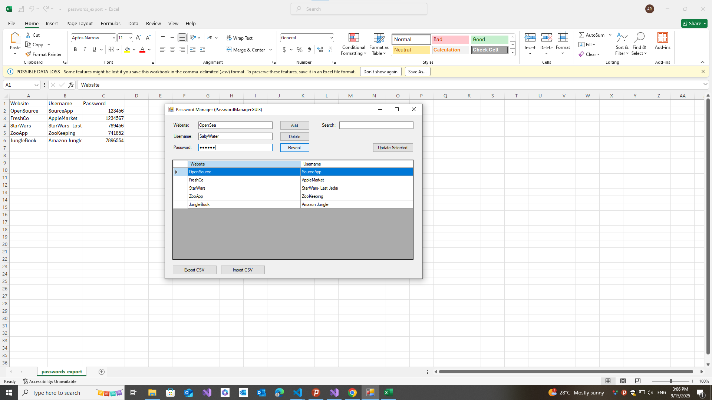

# 🔐 PasswordManagerGUI3

A simple **Windows Forms Password Manager** built with **C# (.NET Framework 4.7.2)** and **SQLite**.  
This project was created step-by-step as a learning path for mastering **C# through project-based learning**.

---

## ✨ Features

- Add, Update, Delete accounts  
- Store passwords encrypted with AES (demo key for now)  
- Reveal decrypted passwords  
- Search accounts by website/username  
- Export accounts to CSV (⚠️ passwords exported in plain text)  
- Import accounts from CSV (skips duplicates)  
- Uses **SQLite** database (`passwords.db`) stored locally in the app folder  

---

## 📂 Project Structure

PasswordManagerGUI3/

│
├── Program.cs # App entry point

├── Form1.cs # Application logic (CRUD + CSV + crypto)

├── Form1.Designer.cs # UI layout and controls

├── Form1.resx # Resources for Form1

├── passwords.db # SQLite database (auto-generated at runtime)

└── README.md # Project documentation

----

## 📸 Screenshots

| 🔐 | 
|------|
|  |

---

